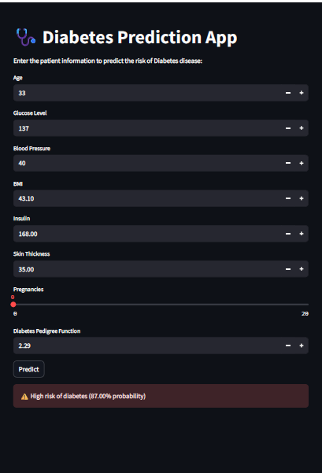

# 🩺 Diabetes Prediction using Machine Learning

## 📌 Overview
This project develops a machine learning model to predict the likelihood of diabetes based on clinical features, including Pregnancies, Glucose, Blood Pressure, Skin Thickness, Age, cholesterol levels, and other relevant factors. The goal is to assist in early detection and support medical decision-making through data-driven insights.

## 🚀 Features
- Exploratory Data Analysis
- Data Preprocessing: Feature scaling, Handling inbalance class distribution
- Model Selection: Evaluation of multiple ML classifiers (e.g., Random Forest, XGBoost)
- Performance Metrics: Accuracy, precision, recall, F1-score, ROC-AUC curve
- Deployment: Interactive web interface using Streamlit

## 🛠️ Installation

**Clone the repository**

```bash
git clone https://github.com/auspicie/Diabetes_Prediction-ML.git
cd Diabetes_Prediction-ML

**Install dependencies**
pip install -r requirements.txt
```

## 💻 Usage

**Run the Streamlit app:**
streamlit run diabetes_disease_app.py


**Interact with the app**: Input values and view predictions in your browser.
## ✨ Example Prediction
Input: `Male, Age: 58, Cholesterol: 230, ...`  
'Pregnancies, 5:, Glucose, 120:, BloodPressure, 70:, SkinThickness,30...
Output: ✅ *⚠️ High risk of diabetes (87.00% probability)

## 📷 Streamlit App Preview



---

## 📊 Dataset
Source: [https://www.kaggle.com/datasets/akshaydattatraykhare/diabetes-dataset]

Clinical Features: Pregnancies, Glucose, BloodPressure, SkinThickness, etc.

## 🤝 Contributing

Contributions are welcome! Feel free to:
Open an issue
Submit a pull request

## 📄 License
This project is licensed under the MIT License.

## 📌 Notes
- Handle the inbalance in target class distribution to ensure model robustness
- Ensure that the `heart_disease_model.pkl` and `scaler.pkl` are in the same directory as the app.

### Author: Samsudeen Bankole
Built with Streamlit and Scikit-learn.